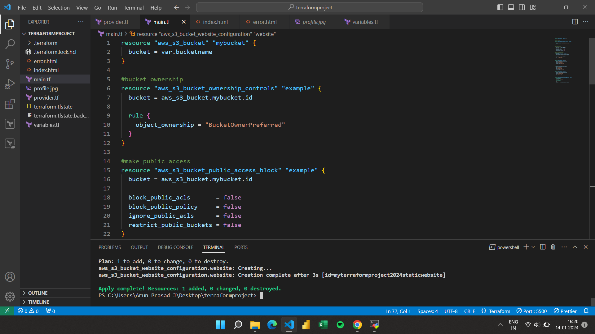
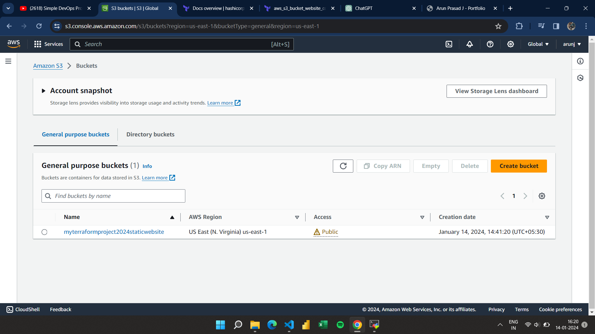
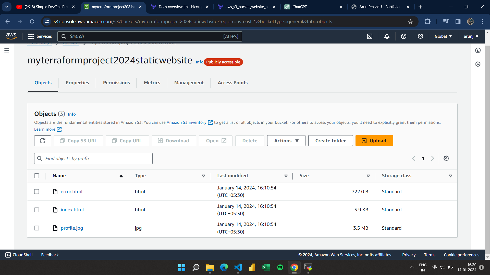

# Hosting Static Website with Terraform

This guide demonstrates how to host a static website using Terraform on AWS S3 (Simple Storage Service).

## Prerequisites

1. **AWS Account**: You need an AWS account to create the necessary resources.
2. **Terraform Installed**: Make sure Terraform is installed on your local machine. You can follow the [installation guide](https://learn.hashicorp.com/tutorials/terraform/install-cli) if you haven't installed it yet.
3. **AWS CLI Installed and Configured**: AWS CLI should be installed and configured with appropriate credentials. Follow the [AWS CLI Configuration Guide](https://docs.aws.amazon.com/cli/latest/userguide/cli-configure-quickstart.html) if you haven't set it up already.
4. **HTML Files**: Prepare your static website files, such as `index.html`, `error.html`, and any other assets you want to host.

## Terraform Files

Your Terraform project should consist of the following files:

- **main.tf**: Contains the main Terraform configuration for provisioning resources.
- **variables.tf**: Defines input variables used in your Terraform configuration.
- **provider.tf**: Specifies the provider (AWS) and any provider-specific configurations.

## Steps

### 1. Clone the Repository

```bash
git clone <repository-url>
cd <repository-directory>
```

### 2. Update Terraform Configuration

Update the Terraform configuration files with your own configurations:

- **main.tf**: Update `bucket_name` variable with your desired S3 bucket name and configure other resources as needed.
- **variables.tf**: Adjust variables if necessary.
- **provider.tf**: If necessary, update provider configurations (e.g., AWS region).


### 3. Initialize Terraform

Initialize Terraform in your project directory:

```bash
terraform init
```

### 4. Plan and Apply Infrastructure Changes

Generate and review the execution plan:

```bash
terraform plan
```

Apply the changes to create the infrastructure:

```bash
terraform apply
```




### 5. Upload Website Files

Upload your website files to the S3 bucket created by Terraform:

- `index.html`
- `error.html`
- Any other assets (images, CSS, JavaScript, etc.)



### 6. Verify Deployment

Access your website using the S3 bucket URL or the custom domain if configured. Verify that both `index.html` and `error.html` are accessible.


### 7. Clean Up

After testing, tear down the infrastructure to avoid unnecessary charges:

```bash
terraform destroy
```


